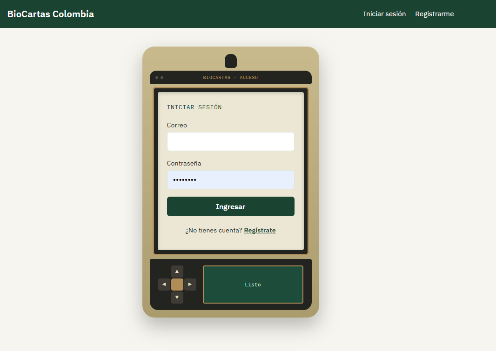
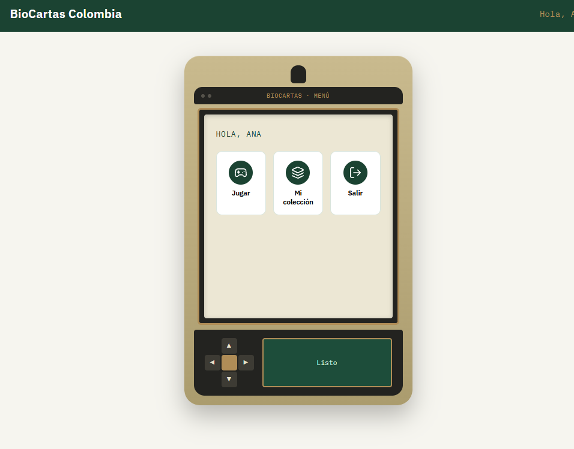
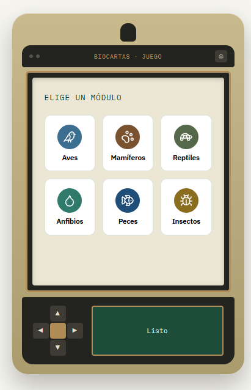
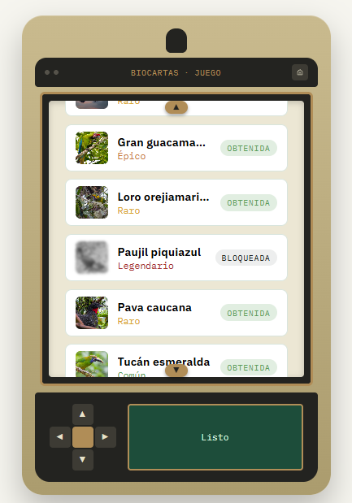
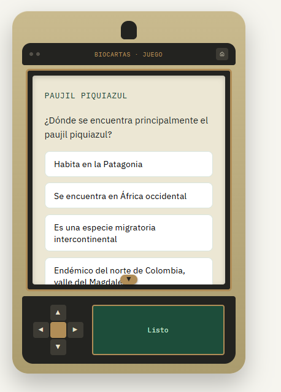
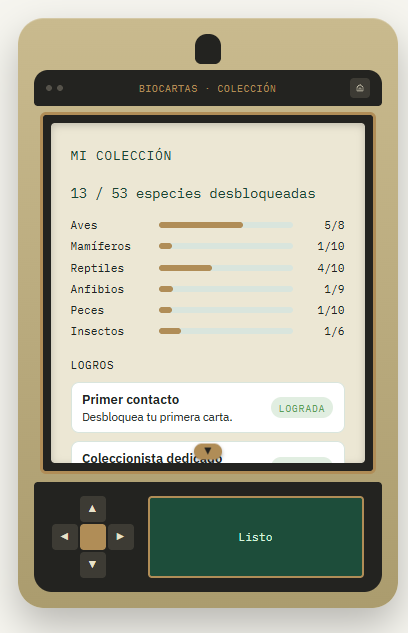
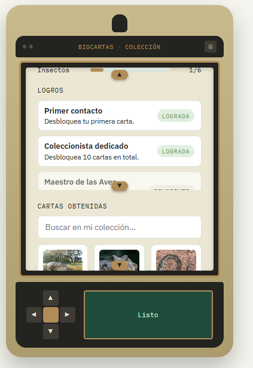
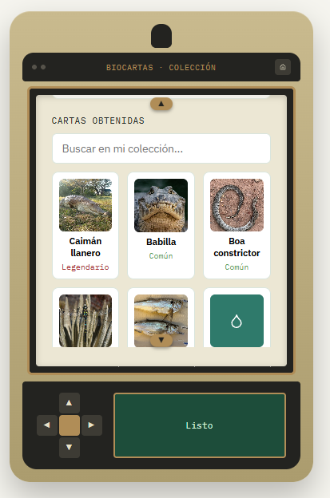
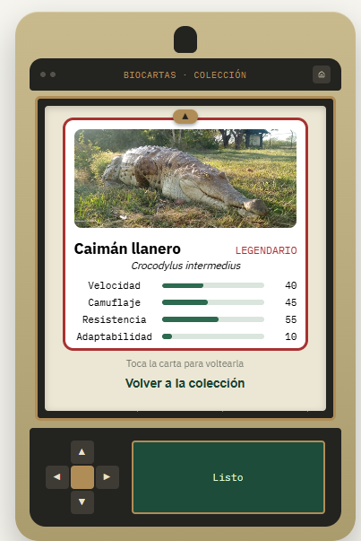
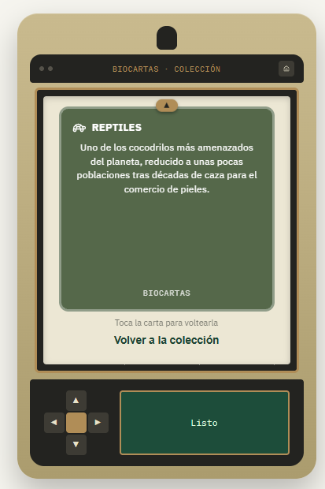

# BioCartas Colombia

🔗 **Demo en vivo:** [https://biocartas-colombia.vercel.app](https://biocartas-colombia.vercel.app)
(el backend está en el plan gratuito de Render — la primera carga puede tardar unos segundos mientras el servidor "despierta")

Aplicación web de cartas coleccionables gamificadas sobre la fauna silvestre de Colombia. Los usuarios desbloquean cartas de especies reales respondiendo preguntas sobre su biología, y la rareza de cada carta está directamente ligada a su estado de conservación real según la UICN (Común = Preocupación Menor, hasta Legendario = En Peligro Crítico).

Construida como propuesta de desarrollo dirigida al Instituto Humboldt, con stack **PERN** (PostgreSQL, Express, React, Node) y arquitectura por capas.

## Tecnologías

- **Frontend:** React 18 + Vite, React Router, Context API
- **Backend:** Node.js + Express, arquitectura por capas (rutas → controladores → servicios → repositorios)
- **Base de datos:** PostgreSQL + Prisma ORM
- **Autenticación:** JWT
- **Contenedores:** Docker + Docker Compose
- **Pruebas:** Jest (backend), Vitest + React Testing Library (frontend)
- **Imágenes:** obtenidas automáticamente con licencia abierta vía la API de iNaturalist

## Funcionalidades

### 🔐 Autenticación

Registro e inicio de sesión con JWT. La sesión se guarda en `localStorage` y se restaura automáticamente al recargar la página, sin pedir login de nuevo mientras el token siga siendo válido.



### 🏠 Menú principal

Al iniciar sesión, el usuario llega a un menú tipo "launcher" dentro del propio dispositivo — íconos para Jugar, Mi Colección y Salir, en vez de una barra de navegación tradicional en el header. Toda la navegación de la aplicación vive dentro de la "pantalla" del dispositivo, no fuera de ella.



### 🎮 Juego y gamificación

Este es el corazón de la aplicación. El flujo completo:

1. **Elegir un módulo** — el usuario selecciona uno de los 6 grupos taxonómicos (Aves, Mamíferos, Reptiles, Anfibios, Peces, Insectos). Cada módulo tiene su propio color e ícono, iguales a los que aparecen en el reverso de sus cartas.
2. **Ver las especies del módulo** — lista con miniatura, nombre y rareza. Las especies que ya se tienen se muestran a color; las bloqueadas, en blanco y negro.
3. **Responder una trivia** — al elegir una especie bloqueada, aparece una pregunta de opción múltiple sobre su biología real (hábitat, dieta, comportamiento, estado de conservación). Las opciones se mezclan en un orden distinto cada vez, así que memorizar "la primera opción" nunca funciona.
4. **Acertar o fallar** — si la respuesta es correcta, la carta se desbloquea. Si es incorrecta, aparece una pista en la mini-pantalla del dispositivo y se puede intentar de nuevo con la misma pregunta.
5. **Revelar la carta** — la carta nueva aparece boca abajo, se expande, y se voltea para mostrar el frente con sus estadísticas. Esta animación se repite cada vez que se selecciona una carta, incluso una ya obtenida.







#### Rareza basada en datos reales

La rareza de cada carta **no es arbitraria** — está directamente ligada al estado de conservación real de la especie según la Lista Roja de la UICN:

| Rareza     | Estado UICN             |
| ---------- | ----------------------- |
| Común      | Preocupación Menor (LC) |
| Poco Común | Casi Amenazada (NT)     |
| Raro       | Vulnerable (VU)         |
| Épico      | En Peligro (EN)         |
| Legendario | En Peligro Crítico (CR) |

Entre más amenazada está una especie en la vida real, más difícil es conseguir su carta — la mecánica de juego refuerza el mensaje de conservación en vez de competir con él.

### 🗂️ Mi colección

La pantalla de colección reúne tres cosas:

- **Progreso por módulo** — una barra por cada grupo taxonómico, mostrando cuántas especies de ese grupo se han desbloqueado sobre el total.
- **Logros** — se calculan dinámicamente comparando la colección actual contra el catálogo completo (por ejemplo, "Maestro de las Aves" se activa solo cuando las 8 cartas de ese módulo están desbloqueadas), en vez de guardarse como un estado separado que se pueda desincronizar.
- **Galería de cartas** — todas las cartas obtenidas, con un buscador para filtrar por nombre. Cada carta se puede abrir para ver su reverso: un dato curioso real sobre la especie, no relleno genérico.











### 🕹️ Identidad visual: el "dispositivo de campo"

Toda la experiencia de juego (login, menú, trivia, colección) vive dentro de un componente reutilizable inspirado en dispositivos GPS de campo tipo Garmin: una carcasa caqui/negra con pantalla enmarcada, un D-pad funcional y un botón central de Enter.

- El **D-pad** mueve el foco entre los elementos interactivos de la pantalla (inputs, botones, cartas); el botón central activa el que esté seleccionado — toda la aplicación se puede usar sin mouse.
- La **mini-pantalla** junto al D-pad muestra el estado en tiempo real: errores de login, pistas de trivia, o el mensaje de felicitación al ganar una carta.
- Una pequeña animación de "adquiriendo señal" simula el encendido del dispositivo cada vez que se entra a una pantalla nueva.

## Requisitos previos

- [Docker Desktop](https://www.docker.com/products/docker-desktop/) instalado y corriendo
- Git
- (Opcional) [GitHub CLI](https://cli.github.com/) si quieres usar los comandos de PR documentados en el flujo de trabajo del proyecto

No necesitas tener Node.js ni PostgreSQL instalados en tu máquina — todo corre dentro de contenedores.

## Puesta en marcha

### 1. Clonar el repositorio

```bash
git clone https://github.com/TU-USUARIO/biocartas-colombia.git
cd biocartas-colombia
```

### 2. Configurar variables de entorno

**Backend:**

```bash
cd backend
copy .env.example .env
```

Abre `backend/.env` y reemplaza `JWT_SECRET` con una cadena aleatoria segura. Puedes generarla con:

```bash
node -e "console.log(require('crypto').randomBytes(64).toString('hex'))"
```

El resto de los valores ya están listos para trabajar con la configuración de Docker Compose del proyecto.

**Frontend:**

```bash
cd ../frontend
copy .env.example .env
cd ..
```

No requiere cambios para desarrollo local.

### 3. Levantar los servicios

```bash
docker-compose up --build
```

| Servicio   | Descripción                         | URL                   |
| ---------- | ----------------------------------- | --------------------- |
| `frontend` | Aplicación en React                 | http://localhost:5173 |
| `backend`  | API en Express                      | http://localhost:5000 |
| `postgres` | Base de datos                       | localhost:5432        |
| `adminer`  | Interfaz visual de la base de datos | http://localhost:8080 |

Espera a ver `[PostgreSQL] Conectado correctamente` y `[Server] Escuchando en http://localhost:5000` en la terminal.

### 4. Migraciones y datos iniciales

En otra terminal, con los contenedores corriendo:

```bash
docker-compose exec backend npx prisma migrate dev
docker-compose exec backend npx prisma db seed
docker-compose exec backend npm run fetch-images
```

El último comando busca fotos reales con licencia abierta para cada una de las 54 especies. Puede tardar varios minutos; es esperado que algunas especies muy raras (con poblaciones diminutas) no encuentren foto — la aplicación las muestra con un ícono de respaldo en vez de una imagen rota.

### 5. Usar la aplicación

Abre **http://localhost:5173**, regístrate, y elige un módulo desde el menú principal para empezar a coleccionar cartas.

Para ver las tablas directamente: entra a **http://localhost:8080** con sistema `PostgreSQL`, servidor `postgres`, usuario `biocartas`, contraseña `biocartas_dev`, base de datos `biocartas`.

## Ejecutar las pruebas automatizadas

```bash
# Backend
docker-compose exec backend npm test

# Frontend
docker-compose exec frontend npm test
```

## Instalar nuevas dependencias

Como `node_modules` vive en un volumen dentro de cada contenedor, cualquier paquete nuevo debe instalarse **dentro** del contenedor correspondiente, o quedará desincronizado del código:

```bash
docker-compose exec backend npm install <paquete>
docker-compose exec frontend npm install <paquete>
```

## Estructura del proyecto

biocartas-colombia/
├── backend/
│ ├── prisma/
│ │ ├── schema.prisma # Modelos de datos
│ │ └── seed.js # Datos reales de las 54 especies
│ ├── scripts/
│ │ └── fetch-images.js # Búsqueda automática de fotos (iNaturalist)
│ └── src/
│ ├── config/ # Conexión a base de datos y variables de entorno
│ ├── repositories/ # Acceso a datos vía Prisma Client
│ ├── services/ # Lógica de negocio (rareza, gamificación, logros)
│ ├── controllers/ # Orquestan cada petición HTTP
│ ├── routes/ # Endpoints de la API
│ └── middlewares/ # Autenticación y manejo de errores
└── frontend/
└── src/
├── api/ # Clientes HTTP hacia el backend
├── components/ # DeviceFrame, FlipCard, CardPanel, ScrollBox...
├── context/ # AuthContext (sesión global)
├── hooks/ # useAuth
├── pages/ # Home, Login, Register, Dashboard, Play, Collection
├── styles/ # theme.css (tokens de diseño y estilos)
└── utils/ # rarity.js, groups.js

## Solución de problemas comunes

**`ECONNREFUSED` al conectar a la base de datos:** confirma que Docker Desktop esté abierto y que el servicio `postgres` haya iniciado correctamente (`docker-compose logs postgres`).

**`Cannot find module` después de instalar un paquete:** probablemente se instaló en la máquina host en vez de dentro del contenedor. Repite la instalación con `docker-compose exec <servicio> npm install`.

**Cambios en `.env` no se reflejan:** los contenedores solo leen `.env` al arrancar. Después de editarlo:

```bash
docker-compose up -d --force-recreate backend
```

**Aparece un mensaje sospechoso en la consola** con el formato `◇ injected env ... // tip: ...` seguido de un dominio desconocido: no es un mensaje real de la librería `dotenv`. Verifica con `npm ls dotenv` qué versión está instalada y no interactúes con ningún enlace que aparezca ahí.

## Flujo de trabajo (Git)

- `main`: código estable.
- `develop`: rama de integración.
- `feature/*`, `fix/*`, `test/*`, `chore/*`: una rama por tarea, creada desde `develop`.

Convención de commits: [Conventional Commits](https://www.conventionalcommits.org/) (`feat:`, `fix:`, `chore:`, `docs:`, `test:`, `refactor:`).
